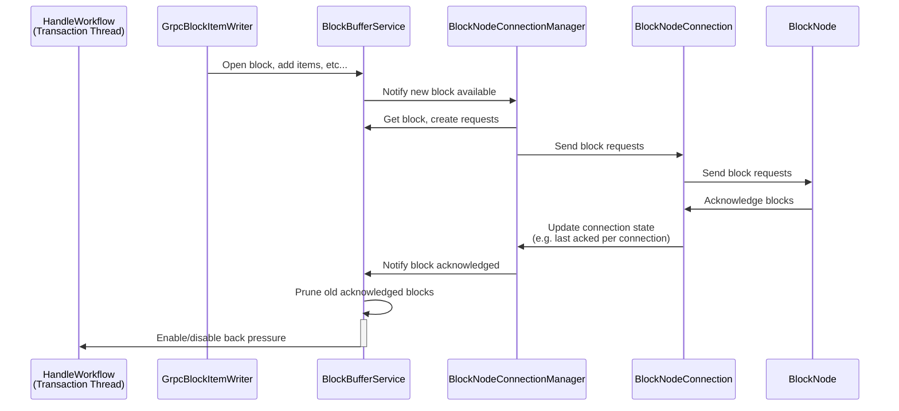

# BlockBufferService.md

## Table of Contents

1. [Abstract](#abstract)
2. [Component Responsibilities](#component-responsibilities)
3. [State Management and Flow](#state-management-and-flow)
4. [Component Interaction](#component-interaction)
5. [Sequence Diagrams](#sequence-diagrams)
6. [Error Handling](#error-handling)

## Abstract

The `BlockBufferService` is responsible for maintaining the most recent blocks, along with their items and requests,
produced by a given consensus node in an ordered manner.

## Component Responsibilities

- Keeps a recent history of blocks produced by the consensus node.
- Tracks which blocks are currently being produced and what the latest (or highest) block acknowledged by the block node.
- Provides an interface for access any block that is held in the buffer.
- Regularly prunes the buffer to reclaim memory after a block has been acknowledged and exceeded the max TTL.
- Monitors the buffer for saturation (i.e. too many blocks unacknowledged) and applies back pressure if necessary.

## State Management and Flow

- Updates stream progress on receipt of new blocks or acknowledgments.
- Implements backpressure and flow control logic to handle varying network conditions.
- Maintains an internal buffer of blocks with timestamps for acknowledgment tracking.
- Periodically prunes acknowledged blocks exceeding the TTL to maintain buffer size and resource efficiency.
- Calculates buffer saturation as a percentage of ideal max buffer size derived from TTL and block period.
- Activates or deactivates backpressure based on saturation status, coordinating with blocking futures to manage flow control.

## Component Interaction

- New blocks and their items are received from `GrpcBlockItemWriter`.
- Bi-directional communication with `BlockNodeConnectionManager` to notify new blocks available and receive updates on
  when new blocks are acknowledged by the block node(s).
- Applies back pressure via `HandleWorkflow`.

## Backpressure Mechanism

The block stream system implements a backpressure mechanism to ensure that block nodes keep pace with the incoming block stream.
If block acknowledgments are delayed beyond a configurable threshold, this mechanism activates to halt further block production and transaction handling on the consensus node.
This ensures system stability and prevents the accumulation of unacknowledged blocks in the stream buffer.

### Buffer Management

The system maintains a buffer of block states in `BlockBufferService` with the following characteristics:

- Each block state contains the block items and requests for a specific block number.
- The buffer tracks acknowledgment status as a single high watermark.
- Entries remain in the buffer until acknowledged and expired, according to a configurable TTL (Time To Live).
- A periodic pruning mechanism removes acknowledged and expired entries.
- The buffer size is monitored to implement backpressure when needed.

### Backpressure Implementation

The backpressure mechanism operates at two levels:

1. **Block State Buffer Level**
   - An asynchronous thread is continuously running in the background to prune the buffer.
   - Pruning occurs on a configurable interval defined in `blockStream.blockBufferPruneInterval` (if set to `0`, the pruning is disabled)
   - Acknowledged states older than `blockStream.blockBufferTtl` are removed
   - If buffer size exceeds safe thresholds after pruning, backpressure is applied
2. **HandleWorkflow Level**
   - `HandleWorkflow` checks for backpressure signals before processing each round of transactions
   - When backpressure is active, block production and transaction handling are paused
   - Processing resumes only after back pressure is removed (i.e. once blocks in the buffer are being acknowledged in
     a timely manner)

### Backpressure Flow

1. **Monitoring Phase**
   - `BlockBufferService` tracks buffer size and block age
   - Periodic pruning task runs based on `blockStream.blockBufferPruneInterval`
   - Buffer metrics are updated for monitoring purposes
2. **Triggering Phase**
   - Backpressure triggers when:
     - Acknowledgments do not arrive within the configured TTL
     - Buffer size grows beyond safe threshold due to unacknowledged or delayed block responses
     - Pruning cannot reduce buffer size sufficiently
     - Block nodes fall significantly behind in processing
3. **Application Phase**
   - `HandleWorkflow` receives backpressure signal
   - Block production and transaction processing pauses
   - Streaming continues for already generated blocks to allow block nodes to catch up
   - Buffer gradually reduces as blocks are acknowledged
4. **Recovery Phase**
   - Buffer saturation recovers as more blocks are acknowledged
   - Once buffer reaches safe levels, backpressure releases
   - Transaction processing resumes

## Sequence Diagrams

