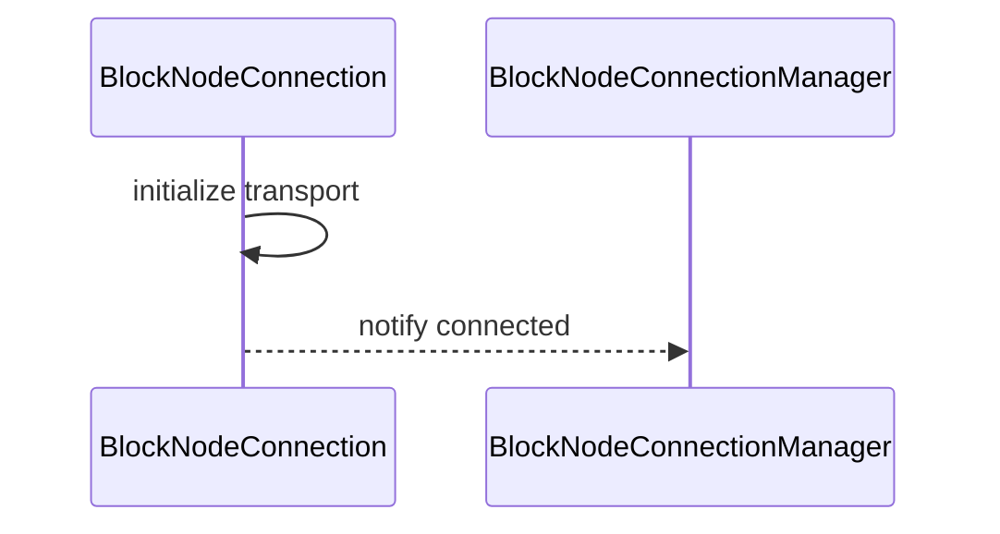
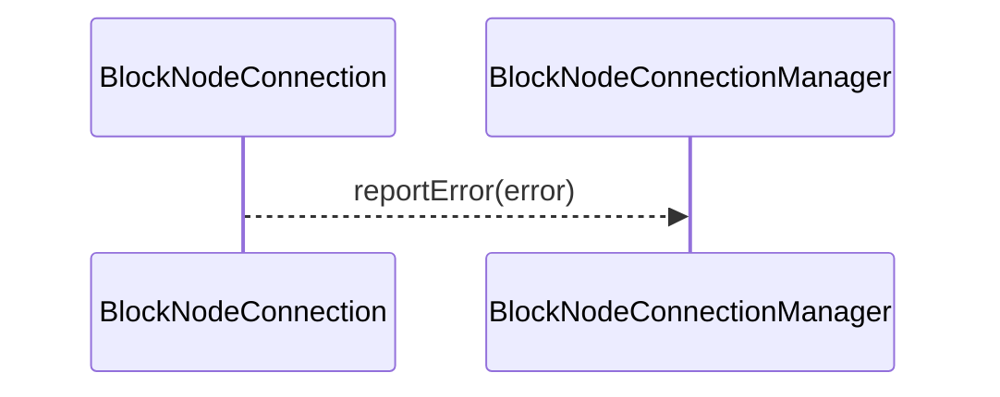

# BlockNodeConnection.md

## Table of Contents

1. [Abstract](#abstract)
2. [Definitions](#definitions)
3. [Component Responsibilities](#component-responsibilities)
4. [Component Interaction](#component-interaction)
5. [State Management](#state-management)
6. [Sequence Diagrams](#sequence-diagrams)
7. [Error Handling](#error-handling)

## Abstract

`BlockNodeConnection` represents a single connection between a consensus node and a block node.
It manages connection state, handles communication, and reports errors to the `BlockNodeConnectionManager`.

## Definitions

<dl>
<dt>BlockNodeConnection</dt>
<dd>A connection instance managing communication and state with a block node.</dd>

<dt>ConnectionState</dt>
<dd>Represents current connection status: UNINITIALIZED, PENDING, ACTIVE, CONNECTING.</dd>
</dl>

## Component Responsibilities

- Establish and maintain the connection transport.
- Handle incoming and outgoing message flow.
- Report connection errors promptly.
- Coordinate with `BlockNodeConnectionManager` on lifecycle events.
- Notify the block buffer (via connection manager) when a block has been acknowledged and therefore eligible to be
  pruned.

## Component Interaction

- Communicates bi-directionally with `BlockNodeConnectionManager`.

## State Management

- Tracks connection lifecycle state.
- Handles status transitions.

## Sequence Diagrams

### Connection Initialization

## Error Handling

- Detects and reports connection errors.
- Cleans up resources on disconnection.

### Consensus Node Behavior on EndOfStream Response Codes

| Code                      | Connect to Other Node | Retry Current Node Interval | Exponential Backoff | Max Retry Delay |                         EndOfStream limit within timespan                          |
|:--------------------------|-----------------------|:----------------------------|---------------------|-----------------|------------------------------------------------------------------------------------|
| `SUCCESS`                 | Immediate             | 30 seconds                  | No                  | 10 seconds      |                                                                                    |
| `BEHIND` with block state | No                    | 1 second                    | Yes                 | 10 seconds      |                                                                                    |
| `BEHIND` with block state | Yes                   | 1 second                    | Yes                 | 10 seconds      | CN sends EndStream to indicate the BN to look for the block from other Block Nodes |
| `INTERNAL_ERROR`          | Immediate             | 30 seconds                  | No                  | 10 seconds      |                                                                                    |
| `PERSISTENCE_FAILED`      | Immediate             | 30 seconds                  | No                  | 10 seconds      |                                                                                    |
| `TIMEOUT`                 | No                    | 1 second                    | Yes                 | 10 seconds      |                                                                                    |
| `OUT_OF_ORDER`            | No                    | 1 second                    | Yes                 | 10 seconds      |                                                                                    |
| `BAD_STATE_PROOF`         | No                    | 1 second                    | Yes                 | 10 seconds      |                                                                                    |
| `UNKOWN`                  | Only log statement    |                             |                     |                 |                                                                                    |
