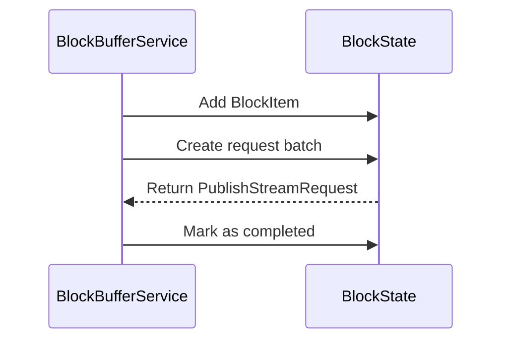
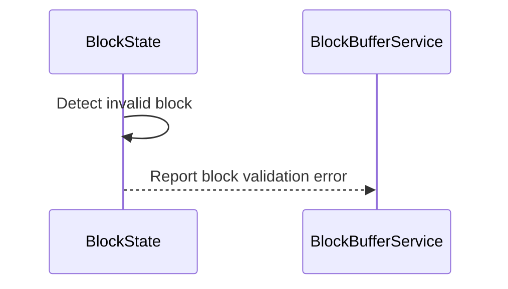

# BlockState.md

## Table of Contents

1. [Abstract](#abstract)
2. [Definitions](#definitions)
3. [Component Responsibilities](#component-responsibilities)
4. [Component Interaction](#component-interaction)
5. [Sequence Diagram](#sequence-diagram)
6. [Error Handling](#error-handling)

## Abstract

`BlockState` encapsulates the state of a single block being processed by the Block Node.
It is responsible for tracking the block number, storing block items (BlockItem),
managing the generation of PublishStreamRequests, and indicating when a block is considered complete and closed.

## Definitions

<dl>
<dt>BlockState</dt> <dd>A component that holds streaming and request data for a single block number, helping support batching, tracking, and stream publication.</dd>
<dt>BlockItem</dt> <dd>An individual unit of work or data associated with a block, to be streamed to downstream systems.</dd>
<dt>PublishStreamRequest</dt> <dd>A request message constructed from one or more BlockItems, used to stream block data.</dd>
</dl>

## Component Responsibilities

- Maintain the block number this instance represents.
- Store all BlockItems associated with the block.
- Create PublishStreamRequests in batches from the items.
- Track whether all necessary requests for the block have been created.
- Record the timestamp when the block is considered closed/completed.
- Expose read-only access to block contents and state.

## Component Interaction

- Passed into streaming pipelines that require access to individual block data.
- Supplies request metadata to connections for stream transmission.
- Used to create streamable requests.

## Sequence Diagram

## Error Handling

- If invalid input is passed (e.g., empty items during forced request creation), the method exits early.
- Ensures the batch size is a minimum of 1.

