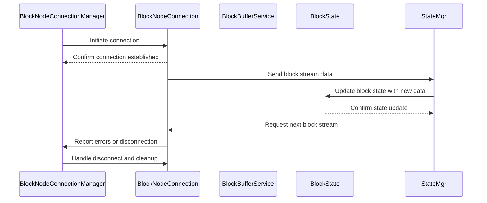

# Block Node Connection Components Design Documents

This folder contains documents describing the internal design and expected behavior
for various components of the Consensus Node (CN) to Block Node (BN) communication. Each document focuses on a single
class or component and its role, including interactions with other components.

## Contents

| Document                                                       |         Component          | Description                                                                                            |
|:---------------------------------------------------------------|----------------------------|:-------------------------------------------------------------------------------------------------------|
| [BlockNodeConnectionManager.md](BlockNodeConnectionManager.md) | BlockNodeConnectionManager | Internal design and behavior of the BlockNodeConnectionManager class, managing node connections.       |
| [BlockNodeConnection.md](BlockNodeConnection.md)               | BlockNodeConnection        | Internal design and behavior of the BlockNodeConnection class, representing an individual connection.  |
| [BlockState.md](BlockState.md)                                 | BlockState                 | Internal design of the BlockState component, managing state information for blocks.                    |
| [BlockBufferService.md](BlockBufferService.md)                 | BlockBufferService         | Internal design and responsibilities of BlockBufferService, handling stream state and synchronization. |

## Components Interaction Flow

The following diagram illustrates the main flow and interactions between these components:

## Block Node Connection Initialization During Consensus Node Startup

During startup of the Consensus Node, if block node streaming is enabled, an asynchronous task will be spawned that will
select a Block Node to connect to and attempt to establish a bi-directional gRPC stream to that node.

### Initialization Flow

The connection initialization is handled by the `Hedera` class and occurs during the Consensus Node startup process.
The initialization flow includes:

1. Configuration Check
   - The primary configuration property that determines if block node streaming is enabled is `blockStream.writerMode`.
     If this property is set to `FILE_AND_GRPC` or `GRPC` then streaming is enabled. Any other value (e.g. `FILE`) means
     streaming is NOT enabled.
2. If streaming is enabled:
   - The connection manager singleton (`BlockNodeConnectionManager`) is retrieved and the startup method is invoked.
   - A background "worker thread" is started whose eventual job is to process block items and send them to the actively
     connected Block Node.
   - Finally, a Block Node is selected to be the active connection. Once this selection process is complete, an asynchronous
     task is created and executed immediately to attempt the connection process. Note: The actual connection process is
     asynchronous from the Consensus Node startup; if there are valid configurations but connection attempts fail, then
     back pressure will eventually be applied, as described in documentation for the block buffer.
   - If there are no Block Nodes available to connect to (e.g. missing or invalid connection configs) then the connection
     manager startup process will fail by throwing an exception: `NoBlockNodesAvailableException`
     - This error will propagate back to the Consensus Node startup where the error will be caught.
     - If the configuration property `blockNode.shutdownNodeOnNoBlockNodes` is set to `true` then the Consensus Node will
       immediately shut down and a fatal log message will be written. If the property is set to `false` then the Consensus
       Node will be permitted to continue startup with only a warning message written to the log. However, keep in mind in
       this latter scenario, eventually back pressure will engage if continued attempts to connect to a Block Node fail.
3. If streaming is NOT enabled, then nothing happens.

## Block Node and Block Stream Configurations

The following configurations are used to control the behavior of block node connections and block streaming.
These configurations ensure scalable, resilient, and tunable block node communication and streaming behavior.

## Block Node Connection Configurations

These settings control how the Consensus Node discovers and connects to Block Nodes, and define fallback behavior if connections fail.
These property names are formatted as `blockNode.[propertyName]`
- Connection File Path & Name: The node loads block node definitions from a file (e.g., `block-nodes.json`) located in a specified directory.
- Connection Management: Parameters like `maxEndOfStreamsAllowed` and `endOfStreamTimeFrame` manage retries and limits.
- Shutdown Behavior: If no connections are made and `shutdownNodeOnNoBlockNodes` is true, the node will shut down to avoid running in a degraded state.

## Block Stream Configurations

These define how the Consensus Node batches, stores, or streams blocks of data. These property names are formatted as:
`blockStream.[propertyName]`
- Streaming Mode: Controlled via `streamMode` and `writerMode`, the node can either write to local files or stream blocks to Block Nodes over gRPC.
- Performance Tuning: Settings like `blockPeriod`, `blockItemBatchSize`, and `buffer TTLs/pruning intervals` help manage throughput and resource usage.
- Block Formation: Parameters such as `roundsPerBlock` and `hashCombineBatchSize` govern how data is grouped into blocks.
