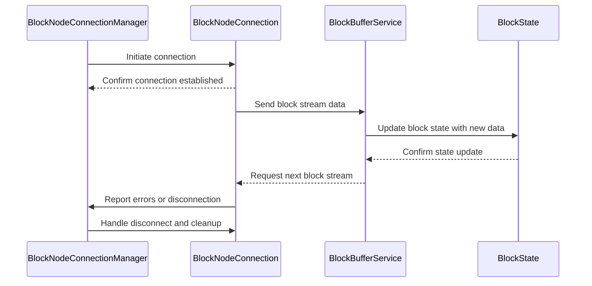
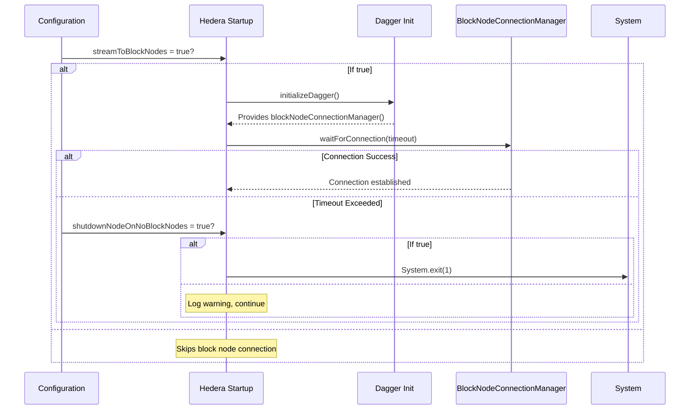

# Block Node Connection Components Design Documents

This folder contains documents describing the internal design and expected behavior
for various components of the Consensus node to Block Node communication. Each document focuses on a single
class or component and its role, including interactions with other components.

## Contents

| Document                                                       |         Component          | Description                                                                                            |
|:---------------------------------------------------------------|----------------------------|:-------------------------------------------------------------------------------------------------------|
| [BlockNodeConnectionManager.md](BlockNodeConnectionManager.md) | BlockNodeConnectionManager | Internal design and behavior of the BlockNodeConnectionManager class, managing node connections.       |
| [BlockNodeConnection.md](BlockNodeConnection.md)               | BlockNodeConnection        | Internal design and behavior of the BlockNodeConnection class, representing an individual connection.  |
| [BlockState.md](BlockState.md)                                 | BlockState                 | Internal design of the BlockState component, managing state information for blocks.                    |
| [BlockBufferService.md](BlockBufferService.md)                 | BlockBufferService         | Internal design and responsibilities of BlockBufferService, handling stream state and synchronization. |

## Components Interaction Flow

The following diagram illustrates the main flow and interactions between these components:

## Block Node Connection Initialization During Consensus Node Startup

During a `Consensus Node` startup, it might establish connections to external `Block Nodes` depending on the configurations.
The connection process is vital to ensure that blocks produced by the `Consensus Node` are streamed to the `Block Nodes` for further processing.

### Initialization Flow

The connection initialization is handled by the `Hedera` class and occurs during the `Consensus Node` startup process.
The initialization flow includes:

1. Configuration Check
   - The following configuration controls whether the Block Node connections should be established:
     `blockStream.streamToBlockNodes = true`
   - If this configuration is set to `false`, the connection process will be skipped.
   - If set to `true`, the connection process will proceed.
2. Dependency Injection Setup
   - The `initializeDagger(...)` method is called during startup to construct and wire dependencies using Dagger.
   - This includes:
     - BlockStreamManager
     - BlockNodeConnectionManager
     - Other block-related and state-related services
   - Dagger provides the `blockNodeConnectionManager()` instance needed to manage connections.
3. Connection Initialization
   - After `Dagger` setup, the following method may be invoked:
     `public void initializeBlockNodeConnections(Duration timeout)`
   - The method will:
     - Log the start of the connection attempt.
     - Wait up to timeout duration for at least one connection to a `Block Node`.
     - Use `blockNodeConnectionManager().waitForConnection(timeout)` to determine success.
4. Failure Handling
   - If no valid block node configurations exists (e.g. they are missing) then if `blockNode.shutdownNodeOnNoBlockNodes`
     is `true` then startup will halt and the node will be shut down. If the configuration is set to `false` then a
     warning will be logged and startup will continue.
   - Asynchronously, one or more attempts to connect to valid block nodes will be performed. If none of the block nodes
     are successfully connected to, then back pressure will eventually engage since no blocks can be acknowledged.

### Initialization Flow Sequence Diagram

## Block Node and Block Stream Configurations

The following configurations are used to control the behavior of block node connections and block streaming.
These configurations ensure scalable, resilient, and tunable block node communication and streaming behavior.

## Block Node Connection Configurations

These settings control how the Consensus Node discovers and connects to Block Nodes, and define fallback behavior if connections fail.
- Connection File Path & Name: The node loads block node definitions from a file (e.g., `block-nodes.json`) located in a specified directory.
- Connection Management: Parameters like `maxEndOfStreamsAllowed` and `endOfStreamTimeFrame` manage retries and limits.
- Shutdown Behavior: If no connections are made and `shutdownNodeOnNoBlockNodes` is true, the node will shut down to avoid running in a degraded state.

## Block Stream Configurations

These define how the Consensus Node batches, stores, or streams blocks of data.
- Streaming Mode: Controlled via `streamMode` and `writerMode`, the node can either write to local files or stream blocks to Block Nodes over gRPC.
- Performance Tuning: Settings like `blockPeriod`, `blockItemBatchSize`, and `buffer TTLs/pruning intervals` help manage throughput and resource usage.
- Block Formation: Parameters such as `roundsPerBlock` and `hashCombineBatchSize` govern how data is grouped into blocks.
