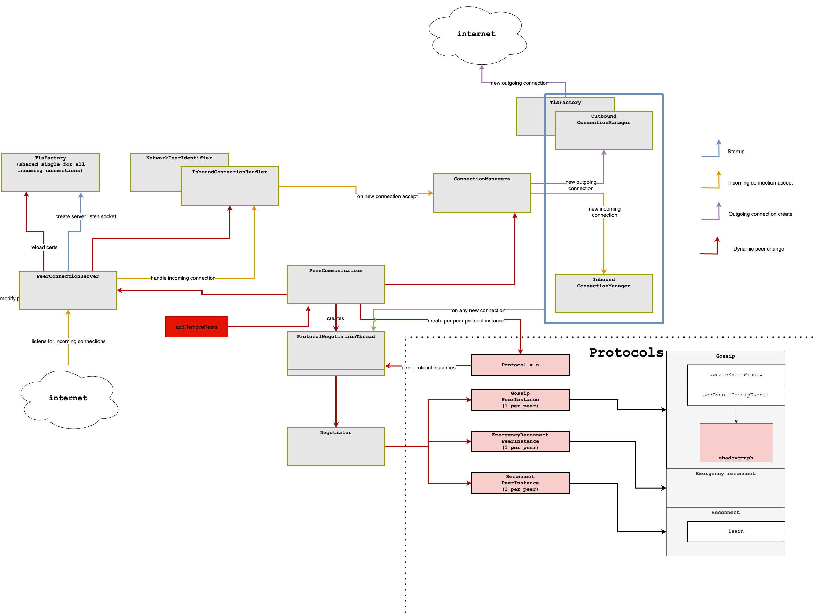

# Dynamic peers

Due to requirements of dynamically changing address book (which nodes are part of the consensus) and topology
(which nodes are connecting to which, assuming that network is not fully connected), we need to allow changing
list of connected peers.

Network/gossip layer should be controlled from single place. Having multiple parties providing unsynchronized changes
to list of peers will cause confusion and possible connection errors.

Main entry point is addRemovePeers(Collection<PeerInfo> added, Collection<PeerInfo> removed). With that call, all
network subcomponents will be informed of the change and disconnect/create new connections as needed. Obviously, this
will take some time, so it is ideal if changes to address book are done in advance of it being needed for actual consensus.

At same time, disconnection can happen quite fast, so we should not remove nodes until well after they are for sure
not needed anymore.

This means that layer before the network, which will handle roster changes, needs to do a smart diff of peers. It shouldn't
blindly apply difference between current and new, but rather get a superset of all rosters which are in possible window
of interest for the consensus (most probably every roster which is not related to ancient rounds and then everything in future).
Then, do a diff between such supersets, as the windows are changing. This means that peer will be added well in advance
of when it is needed and removed well after it is not needed anymore. Network layer cannot decide such things
(as it is not aware of the round boundaries, consensus etc).

It also means that system might receive events from nodes which are not yet part of the consensus or are not part of it
anymore. Such events, if needed, have to be filtered downstream.

In diagram below, red lines show the impact of changing peer list to the network modules.

