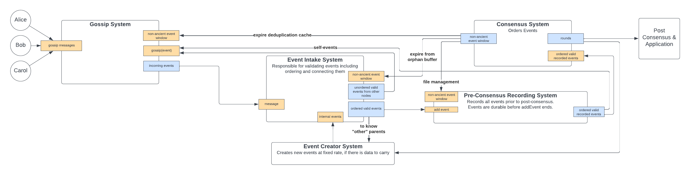

# Inline PCES

## Summary

If a self-event is gossiped and the node is shutdown before the self-event is persisted to disk, then the node will
branch in the hashgraph on restart by building a new self-event on the same self-event parent it had previously used.
In other words, a node must only tell the world of a self-event **after** it has recorded this information!

Self-events are persisted to disk before they are gossiped.

---

## Purpose and Context

Nodes in the network create new "self-events" on a regular basis. These self-events carry transactions that were
submitted to the node, and advance the hashgraph. When a node creates a self-event, it must build upon the previous
self-event and some "other parent" event (see the hashgraph algorithm for more details). There are two types of
branching. If a node builds two self-events on the same self-event parent, that is considered to be a branch. If a node
creates an event with no self parent and there is a non-ancient self event that could have been a self parent, that is
is also considered to be a branch. Branching in the hashgraph is considered an attack on consensus. It can be detected
deterministically and the offending node punished accordingly, protecting the integrity of the hashgraph. Therefore,
no honest node should ever branch.

---

### Architecture and/or Components

At a high level, events are created by the "Event Creator System", they are gossiped
by the "Gossip System", events are handled by the "Event Intake System", persisted by the
"Pre-Consensus Recording System", and come to consensus in the "Consensus System".

In this case, we are only interested in _self events_. These are created by the `Event Creator System` and passed to
the `Event Intake System`. Here, they are ordered and validated and sent to the `Pre-Consensus Recording System`. Here,
they will be immediately persisted and then sent to the `Consensus System` and to the `Gossip System`.

Currently, we do not send any events to the gossip system before they pass through the PCES system. When we
eventually deploy gossip algorithms that call for out of order transmission (e.g. chatter), we may decide to expose
other events (i.e. events not created by ourselves) to gossip before they pass through the orphan buffer.

### Wiring

#### PCES Writer

All writes are synchronous. The PCES writer accepts an event as input, and returns that same event. A configuration
setting, `event.preconsensus.inlinePcesSyncOption` determines the flush to disk behavior. When set to
`EVERY_SELF_EVENT`, each self event causes all events in the write buffer (including the self event) to be flushed to
disk prior to returning. This is the default behavior.

No part of the system after event intake uses events until they passed through the PCES writer, except for Gossip.
Only gossip waits for self-events to be persisted.
