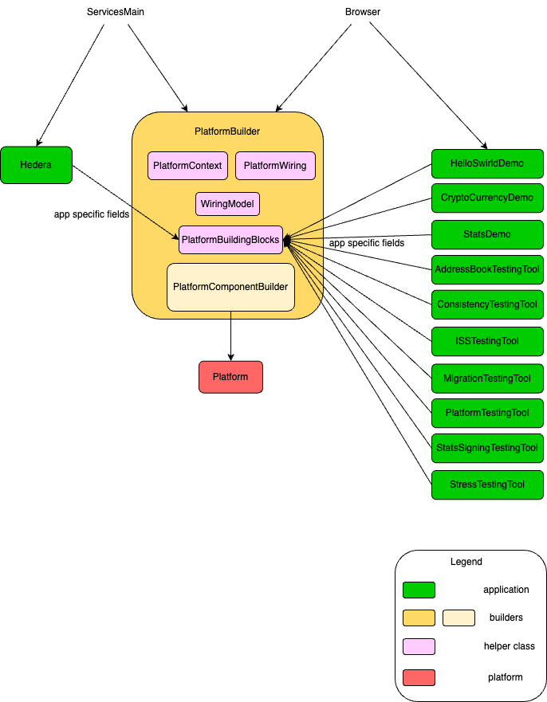

# Platform Building

In order for the platform to be created and started, so that it can start emitting or receiving events, it must be built.
Currently, the main class that holds the platform together is the `SwirldsPlatform`.

To be able to create it, we use several helper classes, builders and a wiring platform that describes the communication
between all the needed components. Basically the platform can be summarized as a set of components that are connected to
each other and perform different actions and operations, where the main workflow is accepting events and producing rounds
ordered by consensus. The logic in-between is conducted by these components.

Let's describe the different helper classes and builders used to create the `SwirldsPlatform`.

## Helper Classes

### PlatformBuildingBlocks

Before we create the actual platform, we need some pieces of data as prerequisites. These are called building blocks.
They can vary based on the specific application that the platform is built for. These blocks are passed from the outside
using the constructor and the builder methods of the `PlatformBuilder`.

They contain bunch of different fields like basic objects, services, callbacks, the wiring itself, the `PlatformContext`,
which contains additional services and configurations. The combination of so many different type of fields
in this single record is a bit chaotic and can be improved.

The `PlatformContext` is an interface that provides access to different services and configurations that the
platform uses. The consumer of this interface, shouldn't manage the lifecycle of the services or the resources.
It makes sense to move services like `PcesFileTracker`, `NotificationEngine`, `SwirldStateManager`,
`TransactionPoolNexus` from `PlatformBuildingBlocks` to the `PlatformContext` to keep them in a single place.

We can tailor the platform by passing specific for the application basic objects or configurations
that will be used to initialise the platform. For example, we can have different app version, main class name,
wiring model, etc.

### PlatformComponentBuilder

The platform consists of different `components` from the wiring framework, that are wired together as a pipeline to
produce a result. Each component is described as an interface, having methods that are exposed in the wiring engine.

`PlatformComponentBuilder` knows the list of components the platform needs to build and provides a mechanism to
override the default implementation with a custom one for each component.

It also contains the `PlatformBuildingBlocks` described in the previous section.

An example for building a component using the `PlatformBuildingBlocks` is the following:

```java
final PcesFileManager preconsensusEventFileManager = new PcesFileManager(
            blocks.platformContext(),
            blocks.initialPcesFiles(),
            blocks.selfId(),
            blocks.initialState().get().getRound());
inlinePcesWriter = new DefaultInlinePcesWriter(
            blocks.platformContext(), preconsensusEventFileManager, blocks.selfId());
```

The `PlatformComponentBuilder` sometimes also creates additional helper class, used to initialize the main components.
In this case it's the `PcesFileManager`.

Other examples are:

```java
1. TransactionResubmitter transactionResubmitter = new DefaultTransactionResubmitter(blocks.platformContext());

2. TransactionPool transactionPool = new DefaultTransactionPool(blocks.transactionPoolNexus());

3. SyncGossip gossip = new SyncGossip(
        blocks.platformContext(),
        AdHocThreadManager.getStaticThreadManager(),
        blocks.keysAndCerts(),
        blocks.rosterHistory().getCurrentRoster(),
        blocks.selfId(),
        blocks.appVersion(),
        blocks.swirldStateManager(),
        () -> blocks.getLatestCompleteStateReference().get().get(),
        x -> blocks.statusActionSubmitterReference().get().submitStatusAction(x),
        state -> blocks.loadReconnectStateReference().get().accept(state),
        () -> blocks.clearAllPipelinesForReconnectReference()
        .get()
        .run(),
        blocks.intakeEventCounter(),
        blocks.platformStateFacade());
```

After the `PlatformComponentBuilder` initializes the components needed, then it can build
the main platform class - `SwirldsPlatform`. `PlatformComponentBuilder` is passed in the constructor of the
`SwirldsPlatform` and is used only to feed it with the building blocks, so that other helper classes can be constructed.
What can be improved is the `PlatformBuildingBlocks` to be passed directly to the `SwirldsPlatform` constructor,
instead of the `PlatformComponentBuilder`.

### PlatformWiring

A key component in the platform that can be interpreted as the "engine" of the whole module is the `PlatformWiring`.
It defines all of the communication channels between the components and the way they are connected to each other. The way
it works is by defining different output and input wires, where the output wire of one component is streaming data
to the input wire of another component.

In order to construct the wiring itself, several initialization phases are performed.

#### Initialize PlatformWiring

The first one is to invoke the constructor of `PlatformWiring`, where all the needed `ComponentWiring` fields are
initialized, using a `WiringModel`, default implementation of the component interfaces needed and a specific
configuration.

This invocation happens in the `PlatformBuilder`.

#### Wiring of the components

After the `ComponentWiring` fields are declared, the next phase is to call the `wire()` method,
which performs the actual wiring of the components and their specific communication by linking output and input wires.
For some of the output wires, special transformers are used to adapt the streamed data to the needed format for
the linked input wire.

This `wire()` method is called in the constructor of the `PlatformWiring`, described in the previous section.

#### Binding

Each of the defined ComponentWiring should be bound to a specific component implementation. This step is performed after
the first 2. All of the wirings are bound or linked to the components. Some of them are passed directly in the `bind()`
method, others are constructed and fetched from the `PlatformComponentBuilder`. The binding itself happens in the
constructor of the main class - `SwirldsPlatform`. The components, which are not part of the `PlatformComponentBuilder`
are defined in this constructor using the `PlatformBuildingBlocks` and then passed to the `bind()` method of
the `PlatformWiring`.

A good clean up will be these components, which are constructed in the `SwirldsPlatform` constructor to be moved to the
`PlatformComponentBuilder` and fetched from there as well. To do so, the `PlatformComponentBuilder` should also hold
the `PlatformContext` and `SignedStateNexus` in order to build these components. Most of the other needed fields are held
into the `PlatformBuildingBlocks` record, which is already part of the `PlatformComponentBuilder`.

### PlatformBuilder

That's the last class, which is responsible for building the `Platform`, using the `PlatformComponentBuilder`. To do so,
it also builds the `PlatformWiring` and the `PlatformBuildingBlocks`, which are contained in the `PlatformComponentBuilder`.

The main benefits of this builder is setting specific app details, all of which become part of the
`PlatformBuildingBlocks` record.

The use of the `PlatformBuilder` ends with the construction of the `Platform`. There is some additional construction
logic in `SwirldsPlatform`. It might be clearer to move this logic inside the `PlatformBuilder` or/and
`PlatformComponentBuilder` and get rid of the `SwirldsPlatform` or leave only the `start()` method.
And after that, even merging the 2 builders and have a common one.

It's important to note, that the `PlatformBuilder` creates the `Platform` by first building the `PlatformComponentBuilder`
and then invoking its `build()` method, that actually constructs the `Platform`. It can be said that in this way
the `Platform` is built transitively.

The reason why we have a separate `PlatformBuilder` is due to the need of a given application to construct their own
specific `Platform` instance. This is because the `PlatformBuilder` accepts these app specific properties,
whereas the `PlatformComponentBuilder` has knowledge only of the components that are needed
for the wiring framework and is more agnostic of the application that is going to be used. It's not fully agnostic,
since it holds the `PlatformBuildingBlocks` record, where the app specific properties passed in the `PlatformBuilder`
are stored into.

The main production `PlatformBuilder` is built inside `ServicesMain`, where the main consensus node class
called Hedera is created with production specific configs, state instance, etc. Currently, however, we support multiple
demo and test related Hedera apps, which are constructed by the `Browser` class, which is deprecated. It needs to
construct a specific `Platform` instance based on the various apps. That's why we have a separate `PlatformBuilder`
that accepts these unique app configurations and properties and create the needed `Platform` instance.
`PlatformBuilder` was initially created by extracting common logic from the `Browser`.

### Overview

Here is a diagram illustrating the connection and sequence between all of the builders and helper classes used to
construct the `Platform` and their dependencies with the different applications that start the
consensus node.


