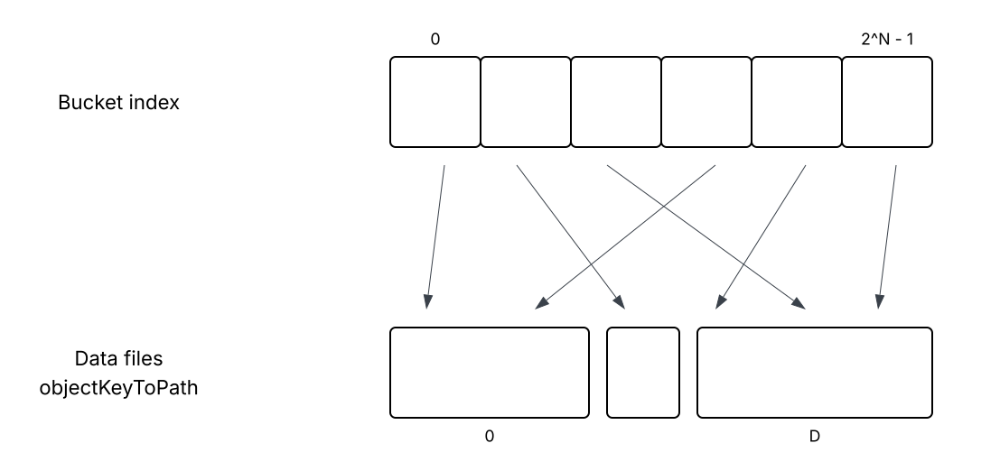
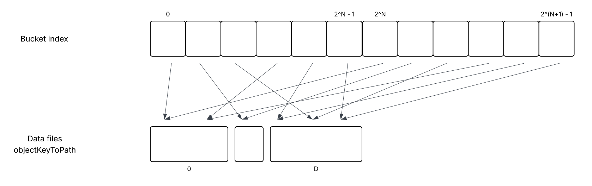
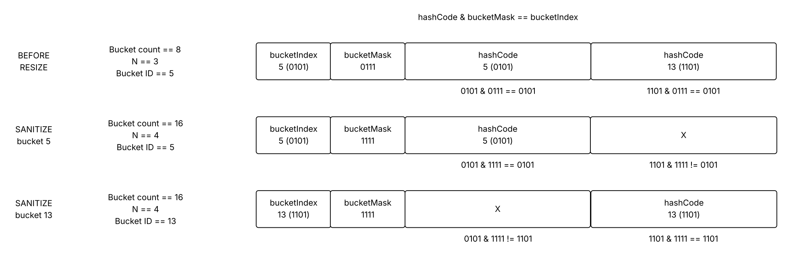

# Scalability - adjusting the number of HalfDiskHashMap buckets

---

## Summary

### Background

`HalfDiskHashMap` is a data structure that holds virtual key to virtual path mapping. Virtual paths
are required to locate key/value records in virtual maps. For every key (object) a path (long) is
stored in `HalfDiskHashMap`. All requests like `VirtualMap.get(key)` first get a path for the key,
and then retrieve the value using this path.

`HalfDiskHashMap` stores key/path mappings in buckets. Every bucket contain the following info:
* Bucket ID: `0` to `N - 1`, where `N` is the number of buckets
* Set of bucket entries

Each bucket entry contains:
* key hash code
* key bytes
* value (path)

When a key is added to `HalfDiskHashMap`, the bucket to add it to is found using key's hash code.
The number of buckets is always a power of two, so the operation is very cheap and straightforward,
just `hashCode & (N - 1)`. It's to take a few lowest bits of the hash code.

Buckets are stored on disk in data files, in the "objectKeyToPath" store. To read and write buckets,
the store uses a bucket index, this is a mapping from buckets IDs (`0` to `N - 1`) to data locations
(file number + offset in the file). Index size is N, it takes N * 8 bytes in memory, since data
locations are longs.

### The problem

The number of buckets is currently fixed and cannot be changed. It's set based on projected map
size in assumption that a bucket should not contain more than 32 key/path entries. For example,
if map size is 1_000_000_000, then the number of buckets is about 32M (2^25, to be precise).
In reality, maps usually contain fewer entities than projected, so some buckets are empty, and
many buckets contain less than 32 entries. However, the whole bucket index for all 32M buckets
is allocated at node startup, it may consume substantial fraction of node RAM.

One approach to reduce memory allocated for the bucket index is to use a lesser number of buckets.
For example, for maps estimated to contain 1_000_000_000 entries use 1M buckets instead of 32M
buckets. It would reduce index size from 256Mb to 8Mb. While the map is small, it would work
fine, but over time it would be very slow. When the map really grows to 1B elements, each bucket
would contain 1K key/path entries, and key lookups in buckets would be prohibitively expensive.

### Proposed solution

There should be a mechanism to increase the number of buckets, when needed. It will let nodes
start with a small number of buckets initially. At the same time, while virtual maps grow in size,
more buckets will be added. This is very similar to what typical hash maps do.

## Architecture

When a MerkleDb database instance is created, it uses virtual map projected size hint to calculate
the size of bucket index as described above. The index is a mapping between bucket IDs and bucket
locations on disk:

Over time, virtual map grow, and the average number of stored elements in a bucket starts to
exceed a certain threshold. This is when the number of buckets needs to be expanded.

### Expanding bucket index

Number of buckets is always a power of 2. When bucket index is expanded, the number of buckets
is doubled to keep it a power of two.

Let's assume the old number of buckets is `2^N`, and the new (updated) number is `2^(N + 1)`, i.e.
two times larger. For every bucket, let's store two entries in the new bucket index:
* 0<bucketID>
* 1<bucketID>
where `bucketID` is the lowest `N` bucket ID bits. This means, two entries in bucket index will
point to the same data location on disk.

### Key lookups after index expanding

How key/path lookups in HDHM work today:
* Get key hash code
* Take N lower bits of the hash code, this will be the bucket ID
* Look up data location for the bucket ID
* Load the bucket from disk
* Iterate over all bucket entries
* For every entry, check the hash code and key bytes. If they are equal to the key in question,
return entry value (path) to the caller, otherwise proceed to the next entry

No changes are needed to these steps after the bucket index is expanded.

### Bucket cleanup after index expanding

After bucket index is expanded as described, there are two issues about it

First, some bucket IDs are wrong. When a bucket is loaded for bucket ID `X`, it may have actual
ID `X`, or its ID may be `X` - `2^N`, assuming the index was resized from `2^N` to `2^(N + 1)`.

Second, all buckets now contain stale entries that should be removed. All entries were
stored correctly when the number of buckets was `2^N`. After resize to `2^(N + 1)`, some entries
from bucket `X` should stay in bucket `X`, while others should be moved to bucket `X + 2^N`,
it depends on the Nth bit value of entry hash code.

To clean up all buckets would be too expensive, as there may be too many buckets to process.
Instead, cleanup will be done lazily, when a bucket is updated. When a bucket is loaded from
disk, all its entries are scanned, entry key hash codes (lower `N + 1` bits) are compared to the
bucket ID, if they don't match, the entry is removed.

### Example

Virtual map size: `200`. Calculated HDHM buckets: `8` (200 / 32, rounded up), bucket index mask is
`0b0111`. Assume there is a bucket with ID `5`, it contains keys with hash codes with lower 3 bits
set to `101`. Bucket index contains 8 elements, index[5] == DL5 (bucket 5 location on disk), all
other index entries are zeroes. Let's also assume bucket 5 contains two keys, with hash codes
`0b01001101` and `0b01000101` (lower 3 bits of both are `101`, this matches the bucket ID).

Now the number of buckets is doubled to 16, the mask is `0b1111`. Bucket index is now 16 elements,
index[5] and index[13] are both set to DL3, all other index entries are zeroes.

When a key with hash code `0b01001101` is requested from the HDHM, it will be looked up in bucket
13 (which is `0b01001101 & 0b1111`). Bucket index for this bucket points to DL5. When a bucket is
loaded from this location, HDHM will iterate over all its entries, find an entry that corresponds
to the key (both key hash code and key bytes match the key), and return its value (path). Similarly,
a key with hash code `0b01000101` will be found using bucket 5.

Now let's add a new key to the map, key hash code is `0b10001101`. The corresponding bucket ID is
13 (hash code & bucket mask). The bucket is loaded from disk, a new entry is added to it. At the
same time, the entry for key `0b01000101` is removed from the bucket, since its hash code combined
with the bucket mask corresponds to bucket 5, not bucket 13. Then bucket 13 with the two entries
is written to disk, and index[13] is updated to the new disk location.

### Threading and synchronization

Bucket index is resized, this process has to be synchronized with all code that reads from or
writes to the index:
* Key reads from MerkleDb
* Flushes to MerkleDb
* Background compaction

Key reads. During index resize, all index entries from `2^N` to `2^(N + 1)` - 1 are set first, then
the current number of buckets is updated from `N` to `2^(N + 1)`. All reads happening in parallel
will read from the first half of the index.

Flushes. Data flush is the only time when key to path mapping is changed in MerkleDb. If bucket
index is resized on the same thread, before or after flushing, it will make sure no changes are
done to the buckets during resizing. Flushes are also the only moment when virtual leaf path range
(virtual map size) can be changed. It makes sense to trigger index resize right after a flush.

Background compaction. During compaction, key to path store content is not changed, but bucket
index is modified as buckets are moved from one data file to another. Index resizing and compaction
must not run in parallel. Note, however, that compaction tasks are only started - if not running
already - after data flushes. So the final flow is as following:

* Data flush to MerkleDb is initiated
* In the end of the flush, check if key to path compaction is in progress or not
* If not, resize bucket index (if needed)
* Then start compaction (if needed)
* If compaction is still in progress, skip index resize. Sooner or later the compaction task will
  be done, and the index will be resized in the end of the next flush

## Performance

Expanding index. Current proposal is very straightforward: double index size and copy elements
`0` to `2^N - 1` to `2^N` to `2^(N + 1) - 1`. This works for all index implementations (heap,
off-heap, disk). Expanding from 1M buckets to 2M buckets (which corresponds to virtual map sizes
30-60m) takes 5-10ms. In the future, when disk-based indices are used, more efficient resize
implementation may be needed.

Bucket updates to remove stale entries with wrong hash codes. Buckets are sanitized only on write
in the end of a flush. Reads are not affected. Real world experiments show that to have another
run through all bucket entries and removing those that are staled does not have impact on TPS
in end to end benchmarks.

## Testing

## Other concerns

### State validation

State validation tool will need to be updated, so it doesn't fail when a bucket entry with a
wrong hash code (doesn't correspond to bucket ID, with the current bucket mask) is found. Bucket
IDs may not correspond to bucket index entries, too, the tool must be able to detect that.

### Default virtual map size hints

Current virtual map size hints in Hedera services code are very hight. At least four tables in
TokenService have hints set to 1B. It results in 1Gb allocated just for bucket indices right
at node startup just for these tables. HintsService also has a few maps with size hints set to
very high values.

With this new mechanism to increase the number of key buckets on the fly, there is no need to
have so large hints. Nodes can start with a low number of buckets, and new buckets will be
created as needed over time.

Current proposal for size hints:
* TokenService.ACCOUNTS: reduce from `1_000_000_000` to `1_000_000`
* TokenService.MINTABLE_NFTS: reduce from `1_000_000_000` to `1_000_000`
* TokenService.TOKENS: reduce from `1_000_000_000` to `1_000_000`
* TokenService.TOKEN_RELS: reduce from `1_000_000_000` to `1_000_000`
* HintsService.CRS_PUBLICATIONS: reduce from `2^31` to `2^10`
* HintsService.HINTS: reduce from `2^31` to `2^10`
* HintsService.PREPROCESSING_VOTES: reduce from `2^31` to `2^10`

Some other tables will be adjusted accordingly. These changes _will not_ affect existing nodes.
When a node is started from an existing state snapshot, all virtual map size hints are ignored,
and the number of buckets is read from the snapshot.
